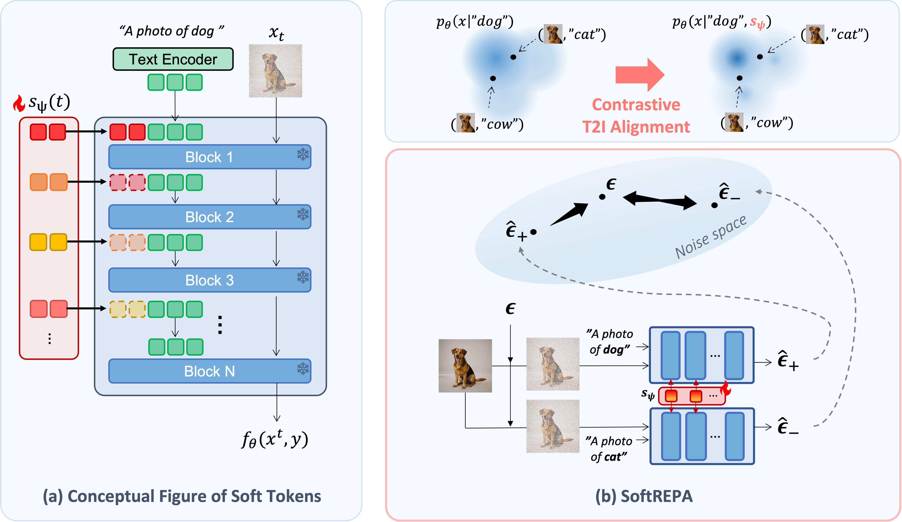

# SoftREPA: Aligning Text to Image in Diffusion Models is Easier Than You Think



## Abstract

❗️ SoftREPA is a lightweight fine-tuning method that improves text-image alignment in text-to-image (T2I) generative models using soft text tokens, adding fewer than 1M trainable parameters.

💡 SoftREPA adopts a contrastive learning approach using denoising score matching logits with both positive and negative pairs to better align image and text representations.

📌 Experiments across generation and editing tasks validate SoftREPA’s effectiveness and efficiency.


## Quick Start

### Environment Setup

First, clone this repository and install requirements.

```
git clone https://github.com/softrepa/SoftREPA.git
cd SoftREPA
conda create -n softrepa python==3.10 -y
conda activate softrepa
pip install -r requirements.txt
```
Enter your huggingface authenticated tokens for using `stabilityai/stable-diffusion-3-medium-diffusers`:
```
huggingface-cli login
```

### Examples

You can quickly check the results using following examples.

**Example 1. Text to Image Generation**
``` 
#vanilla SD3
python sample.py \
    --model sd3 \
    --img_size 1024 \
    --NFE 28 --cfg_scale 4 \
    --save_dir "generated/"
    --save_name "vanilla" \
    --prompt "knolling of a drawing tools for painter.";
```
```
#softrepa
python sample.py \
    --model sd3 --use_dc --use_dc_t True \
    --n_dc_tokens 4 --n_dc_layers 5 \
    --img_size 1024 \
    --NFE 28 --cfg_scale 4 \
    --load_dir "tokens/sd3" \
    --save_dir "generated/"
    --save_name "softrepa" \
    --prompt "knolling of a drawing tools for painter.";
```

**Example 2. Text guided Image Editing**
```
#vanilla SD3 with FlowEdit
python edit_sd3.py \
    --img_size 1024 \
    --NFE 50 --n_start 33 --src_cfg_scale 3.5 --tar_cfg_scale 13.5 \
    --workdir "edited/" \
    --input_path "samples/0001.png" \
    --src_prompt "The image features a yellow building with a green door. The door is closed, revealing a black and white interior. The building also has a window with white curtains, adding a touch of contrast to the scene. Additionally, there is a potted plant placed on the sidewalk in front of the building, providing a touch of greenery to the urban setting.\n" \
    --tgt_prompt "The image features a red building with a green door. The door is open, revealing a black and white interior. The building also has a window with white curtains, adding a touch of contrast to the scene. Additionally, there is a potted plant placed on the sidewalk in front of the building, providing a touch of greenery to the urban setting.\n";
```
```
#softrepa
python edit_sd3.py \
    --use_dc --use_dc_t --n_dc_tokens 4 --n_dc_layers 5 \
    --img_size 1024 \
    --NFE 50 --n_start 30 --src_cfg_scale 3.5 --tar_cfg_scale 9 \
    --load_dir "tokens/sd3" \
    --workdir "edited/" \
    --input_path "samples/0001.png" \
    --src_prompt "The image features a yellow building with a green door. The door is closed, revealing a black and white interior. The building also has a window with white curtains, adding a touch of contrast to the scene. Additionally, there is a potted plant placed on the sidewalk in front of the building, providing a touch of greenery to the urban setting.\n" \
    --tgt_prompt "The image features a red building with a green door. The door is open, revealing a black and white interior. The building also has a window with white curtains, adding a touch of contrast to the scene. Additionally, there is a potted plant placed on the sidewalk in front of the building, providing a touch of greenery to the urban setting.\n";
```

## Training and Evaluation
### Training

- Run the `run_train.sh` file. Undo the annotation for each `--model` training (sd3, sd1.5, sdxl). Change the arguments: `--dweight` for diffusion loss weight combined with contrastive loss, `--n_dc_tokens` for number of soft text tokens per layer, `--n_dc_layers` or `--apply_dc` for designating layers to prepend tokens, `--use_dc_t` for t dependency on tokens.
- Specify the `LOGDIR` and `DATADIR` for saving the checkpoints (default setting is `./data`) and text-image pair datapath (COCO).
- Two gpus are required for one for text, image encoding and the other for denoising. 
- All default settings for each model is defined in `run_train.sh`. 
- This allows us to train 4 `BATCHSIZE` (16 batches for contrastive learning) with two gpus of VRAM 40GB in sd3.
```
sh run_train.sh
```

### Training in large batch
- For distributed learning, all text and image encodings will be pre-computed and saved. Please make sure you have enough room for saving those encodings in your HDD before running `run_train_dist.sh`. (COCO dataset: 9.1T for `sd3`, 1.4T for `sdxl`, and 1.1T for `sd1.5` are required.)
- This allows us to train up to 16 `BATCHSIZE` (256 batches for contrastive learning) with two gpus of VRAM 40GB in sd3.
```
sh run_train_dist.sh
```

### Sampling & Evaluation on T2I Generation
- To use HPSv2 for evaluation metric, please download it to your conda environment path.
```
wget https://openaipublic.azureedge.net/clip/bpe_simple_vocab_16e6.txt.gz -P {ENVPATH}/lib/python3.10/site-packages/hpsv2/src/open_clip/
```
- Specify the `NFE`, `CFG`, `IMGSIZE` for sampling, and set `MODEL`, `USEDCT`, `NTOKENS`, `NLAYERS` same as the training setting. `LOADDIR` for saved token directory. The trained tokens in the paper are provided in `tokens/$MODEL`. 
- All default settings for each model is defined in the file. Please undo the annotation for other models in `run_eval.sh` file.
```
sh run_eval.sh
```
